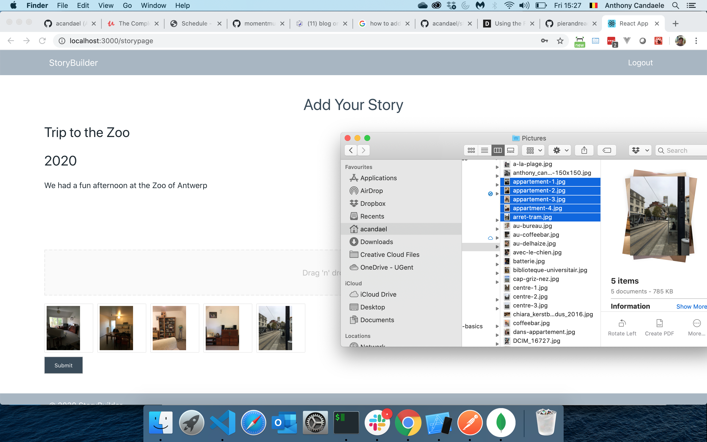

StoryBuilder is a digital photo album. It allows you to organize your pictures into stories. Each story has a title, year, description and a collection of photos. Simply drag your pictures onto the page and upload them.

# The project

Storybuilder was created as a solo project for a software engineering bootcamp.

## Tech Stack

### Frontend

- React
- react-dropzone

### Backend

- Node.js
- Express.js
- MongoDB

### External API'S

- Cloudinary

### Installation

1. Clone the repository
2. Run npm install in the client directory as well as in the server directory
3. Launch the database

### Environment Variables

For the backend you need one environt variable in your .env file:

- JWT_KEY=your_jwt_key

For the front end to work, you need access to the Cloudinary service. In .env on the client you need to set these environment variables:

- REACT_APP_CLOUDINARY_UPLOAD_PRESET=your_upload_preset
- REACT_APP_CLOUDINARY_UPLOAD_URL=your_upload_url
- REACT_APP_CLOUDINARY_API_KEY=your_cloudinary_api_key

## Extending the project

Ideas to extend StoryBuilder are welcome. I think for instance on the ability to comment on the photos.
